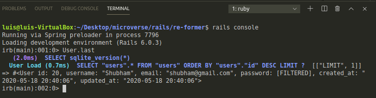

# re-former

In this project, we learned about forms, from the very basic to the Railsy-er ones. We learned how the information is gotten from the form and passed to the controller to create a new record in the database. We applied the previously acquired knowledge of Validations and flash messages.




# Requirements

- Ruby > 2.6.5
- Rails > 6.0.3

## Getting Started

To get started with the app, cd to the directory where you would like the repo to live by typing on your terminal:

```
$ cd <directory>
```

Clone the repo typing:

```
$ git clone https://github.com/lmaldonadoch/re-former.git
```

Install the needed gems:

```
$ bundle install
```

Finally, migrate the database:

```
$ rails db:migrate
```

## Built With

- Ruby
- Rails
- VSCode

## Authors

👤 **Shubham Raj**

- Github: [@ShubhamRaj](https://github.com/shubham14p3)
- Linkedin: [Shubham14p3](https://www.linkedin.com/in/shubham14p3/)

👤 **Luis Angel Maldonado**

- Github: [@lmaldonadoch](https://github.com/lmaldonadoch)
- Twitter: [@LuisAngelMCh](https://twitter.com/LuisAngelMCh)
- Linkedin: [linkedin](https://www.linkedin.com/in/lmaldonadoch)

## 🤝 Contributing

Contributions, issues and feature requests are welcome!

Feel free to check the [issues page](https://github.com/shubham14p3/micro_reddit/issues/).

## Acknowledgement

- Project requested by [Microverse Program](https://www.microverse.org/).
- Original project from [The Odin Project](https://www.theodinproject.com/courses/ruby-on-rails/lessons/forms).

## Show your support

Give a ⭐️ if you like this project!
